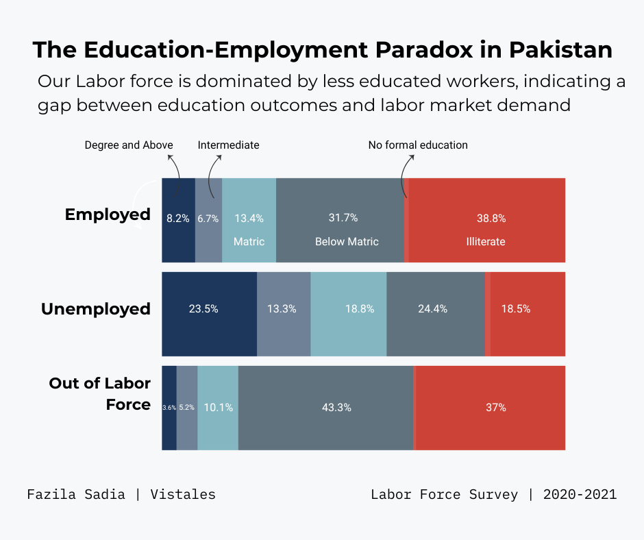

In Pakistan, education is often viewed as the gateway to opportunity — yet the data reveals a more nuanced reality.

This visualization encourages us to think deeper:

* Why are so many educated individuals still struggling to secure employment?

* What types of skills does our labor market truly value today?

* How can we better connect education with meaningful work opportunities?

* And how can industries, institutions, and communities come together to close this divide?

Education opens doors — but only when it walks hand in hand with employability.

